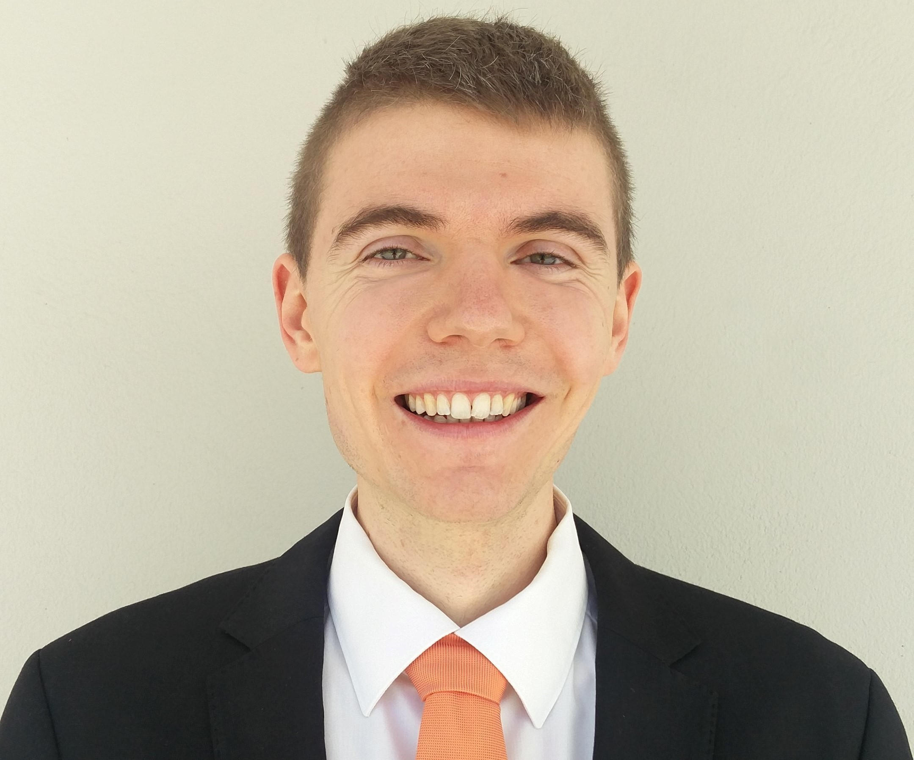

# Welcome to My Website

{: style="width:150px; height:auto; border-radius:50%;" }

Last updated: 15.12.2025

Hello, I’m **Thomas Rauter**, currently a PhD researcher in **Bioinformatics** at the 
Paris-Lodron-University of Salzburg, Austria. This website is my 
professional portfolio, where I share my work, achievements, and ongoing projects.

> **Note**: While much of the information here is also available on my 
> [LinkedIn](https://www.linkedin.com/in/thomas-rauter-003583281), this website presents it in a more
> organized and structured way. It is designed to be a central hub for my professional journey, 
> offering a comprehensive overview that is easy to navigate.

## Technology Badges
Throughout this website, you will see badges like 
. These
badges represent the specific technologies I used in each project, providing a quick and visual way
to understand the tools and frameworks that were applied.

---

Feel free to explore the different pages or connect with me on 
[LinkedIn](https://www.linkedin.com/in/thomas-rauter-003583281) or via 
[email](mailto:rauterthomas0@gmail.com).
